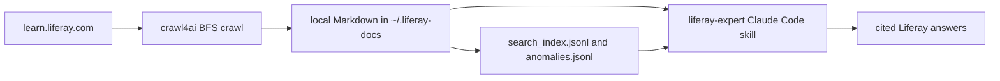

# liferay-context-builder

Give Claude Code a local, source-backed Liferay DXP knowledge base it can
actually read before answering.

`liferay-context-builder` turns the public Liferay docs into a local context
library and pairs it with the `liferay-expert` Claude Code skill. The result is
simple: when someone on the team asks a Liferay question, the assistant can
look up the relevant docs, cite the original URL, and avoid guessing from model
memory.

It is built for team use:

- Answers stay tied to official `learn.liferay.com` sources.
- Every project can share the same local docs folder.
- There is no bundled Liferay content, vector database, or embedding service to
  manage.
- A doctor command checks whether the docs and skill are ready.


[Download the MP4 demo](docs/assets/liferay-doc-demo.mp4)

[Project page](https://mordonez.github.io/liferay-context-builder/) ·
[PyPI package](https://pypi.org/project/liferay-context-builder/) · Python
3.10-3.13 · [MIT license](LICENSE)

## Quickstart

From zero to source-backed Liferay answers in Claude Code:

```bash
# 1. One-time browser setup for crawl4ai/Playwright
uvx --from crawl4ai crawl4ai-setup

# 2. Build the local Liferay DXP context library in ~/.liferay-docs
uvx liferay-context-builder

# 3. Install the Claude Code skill in your current project
npx skills add mordonez/liferay-context-builder --skill liferay-expert -a claude-code

# 4. Verify docs freshness and skill installation
uvx --from liferay-context-builder liferay-context-builder-doctor
```

Then ask Claude Code something like:

> How do I configure synonym sets in Liferay Search?

The skill searches the local context library, reads the best matching pages,
and cites the original `learn.liferay.com` URL.

Keep `-a claude-code` in the install command. It avoids interactive installer
edge cases where the skill can appear installed but not land in
`.claude/skills/`.

## Requirements

- Python 3.10-3.13
- [`uv`](https://docs.astral.sh/uv/)
- Node/npm for `npx skills add`

`crawl4ai` uses Playwright. Run the browser setup once per machine before the
first build:

```bash
uvx --from crawl4ai crawl4ai-setup
```

## How It Works



The official context builder starts at
`https://learn.liferay.com/w/dxp/index` and uses crawl4ai's BFS deep crawler to
follow internal `/w/dxp/*` links. For each page, it extracts the article body,
classifies the URL into a Liferay capability, and writes Markdown locally.

The builder is intentionally boring:

- It fetches from the live Liferay docs when you run it; this package does not
  redistribute Liferay documentation text.
- It writes to one shared docs directory, so every project can use the same
  context library.
- It retries through crawl4ai, writes files atomically, and exits non-zero when
  the crawl or page fetches fail.
- It never starts a long build from inside the skill. If docs are missing, the
  skill tells you which command to run.

## Where Files Go

By default, everything is written under:

```text
~/.liferay-docs
```

Use `LIFERAY_DOCS_DIR` when you want a repo-local or custom context library:

```bash
export LIFERAY_DOCS_DIR="$PWD/.liferay-docs"
uvx liferay-context-builder
uvx --from liferay-context-builder liferay-context-builder-doctor
```

Layout:

```text
~/.liferay-docs/
  raw/{capability}/*.md
  raw/_navigation/{capability}/*.md
  raw/_removed/{capability}/*.md
  raw/community-howto/{capability}/*.md
  raw/community-troubleshooting/{capability}/*.md
  reports/filtered/
    search_index.jsonl
    anomalies.jsonl
    summary.json
    *_urls.txt
```

`raw/{capability}/*.md` is the main official-docs library the skill reads first.
`raw/_navigation/` keeps table-of-contents/navigation pages out of normal
answers while preserving them. `raw/_removed/` holds pages only after the
builder directly confirms their original URL is gone.

## Refreshing The Context Library

Run the builder again whenever you want fresh docs:

```bash
uvx liferay-context-builder
```

A normal full run usually takes tens of minutes. For a smoke test:

```bash
uvx liferay-context-builder --max-pages 200
```

Useful options:

```bash
uvx liferay-context-builder --max-depth 12
uvx liferay-context-builder --max-pages 3000
```

Each full run starts from the current site state. If a previously known page is
not rediscovered by BFS, the builder checks that page directly before moving it
to `raw/_removed/`. If the page is still alive, it refreshes it directly and
records the BFS coverage gap in the reports.

## Community Articles

Community articles are optional, larger, and lower-authority than the official
DXP docs:

```bash
uvx --from liferay-context-builder liferay-context-builder-community
```

This fetches Liferay community How-To and Troubleshooting articles from
`learn.liferay.com/kb-article/*`. They are stored separately:

```text
raw/community-howto/{capability}/*.md
raw/community-troubleshooting/{capability}/*.md
```

Many community articles have no usable capability tag, so they go to
`_uncategorized/`. The skill treats community content as secondary evidence and
says so when citing it.

Useful commands:

```bash
# Only How-To articles
uvx --from liferay-context-builder liferay-context-builder-community --resource-type howto

# Smaller test run per resource type
uvx --from liferay-context-builder liferay-context-builder-community --limit 100
```

Community builds can take much longer than the official-docs build because they
fetch thousands of additional articles.

## Installing The Skill

Install `liferay-expert` into each Claude Code project where you want Liferay
help:

```bash
npx skills add mordonez/liferay-context-builder --skill liferay-expert -a claude-code
```

Manual install also works: place the skill file at:

```text
.claude/skills/liferay-expert/SKILL.md
```

The skill resolves docs the same way the builder does:

1. `$LIFERAY_DOCS_DIR`, if set.
2. `~/.liferay-docs`, otherwise.

When answering, it searches `reports/filtered/search_index.jsonl` when present,
falls back to normal file search under `raw/`, reads Markdown files directly,
and cites the `url:` frontmatter. Official docs are preferred over community
articles when both cover the same topic.

## Doctor

Use the doctor when something feels off:

```bash
uvx --from liferay-context-builder liferay-context-builder-doctor
```

It checks:

- Which docs directory is active.
- Whether official Markdown exists.
- How many community Markdown files exist.
- The official-docs freshness window.
- Search index and anomaly report entry counts.
- Whether `.claude/skills/liferay-expert/SKILL.md` exists in the current
  project.

To inspect a different project directory:

```bash
uvx --from liferay-context-builder liferay-context-builder-doctor --project-dir /path/to/project
```

The doctor does not build docs and does not install the skill. It only reports
status and prints the next command to run.

## Reports

The builder writes agent-facing reports under `reports/filtered/`.

`search_index.jsonl` is a local retrieval index. Each JSON line includes title,
source URL, source type, capability, file path, headings, and `fetched_at`. The
skill uses it first because it is faster and cleaner than searching every
Markdown file.

`anomalies.jsonl` is an informational scrape-quality report. It flags signals
like very short bodies, missing titles, known error markers, unusually large
pages, and large body-size swings versus the previous local copy. It does not
mean a page is unusable; it means the page may deserve a quick check before you
trust or cite it heavily.

`summary.json` records the latest run counts, crawl failures, direct refreshes,
coverage gaps, and search index size.

## Troubleshooting

**`crawl4ai` or browser errors on the first run**

Run the Playwright setup again:

```bash
uvx --from crawl4ai crawl4ai-setup
```

**Claude Code says the skill is missing**

Run the install command from the project where you are using Claude Code:

```bash
npx skills add mordonez/liferay-context-builder --skill liferay-expert -a claude-code
```

Then verify:

```bash
uvx --from liferay-context-builder liferay-context-builder-doctor
```

**Claude Code says docs are missing**

Check whether you are using a custom docs directory:

```bash
echo "$LIFERAY_DOCS_DIR"
```

If it is empty, the skill expects `~/.liferay-docs`. If it points somewhere
else, run the builder with that same environment variable.

**Docs are stale**

Refresh official docs:

```bash
uvx liferay-context-builder
```

The doctor warns when official docs are older than about seven days.

**A build stops partway through**

Rerun the same command. Already written Markdown remains usable, but a failed
run exits non-zero and avoids treating untouched pages as removed.

**Community answers feel weaker than official docs**

That is expected. Community How-To and Troubleshooting articles are useful for
practical cases and errors, but the skill should label them as community
content and prefer official docs when official docs answer the question.

## Development

```bash
uv sync --group dev
uv run ruff check .
uv run --with pytest python -m pytest
uv build
```

Run `uv sync --group dev` once before local development so the project and dev
tools are installed into uv's project environment. The pytest command uses
`python -m pytest` with `--with pytest` because older or unsynced uv
environments can fail to find the `pytest` console script even when Python can
run the module.

CI runs lint, tests, and package build on Python 3.10, 3.11, 3.12, and 3.13.
It does not run a real docs build. Release publishing is documented in
[`docs/release.md`](docs/release.md).

## License

[MIT](LICENSE) applies to this tool and skill only. Liferay documentation
content remains Liferay's content and is fetched locally by each user.
